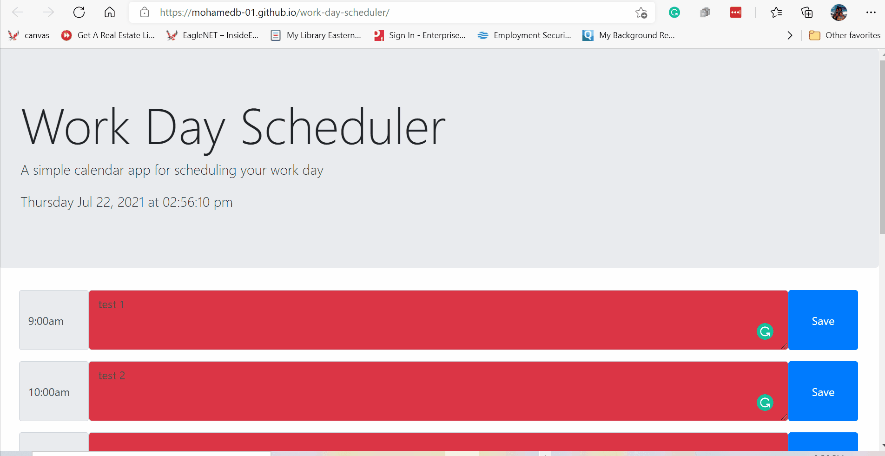

# work-day-scheduler

## Table of Contents
- [Description](#Description)
- [Installation](#Installation)
- [Usage](#Usage)
- [Contributing](#Contribution)
- [Tests](#Tests)
- [License](#License)
- [Contact](#Contact)
- [Link to Repository](#Repository)
- [Link to Deployed page](#Deployed)
    
## Description
A simple calendar application that allows a user to save events for each hour of the day. The app  responds to the following user story and acceptance criteria. 

### User Story

```md
AS AN employee with a busy schedule
I WANT to add important events to a daily planner
SO THAT I can manage my time effectively.
```

### Acceptance Criteria

```md
GIVEN I am using a daily planner to create a schedule
WHEN I open the planner
THEN the current day is displayed at the top of the calendar
WHEN I scroll down
THEN I am presented with timeblocks for standard business hours
WHEN I view the timeblocks for that day
THEN each timeblock is color coded to indicate whether it is in the past, present, or future
WHEN I click into a timeblock
THEN I can enter an event
WHEN I click the save button for that timeblock
THEN the text for that event is saved in local storage
WHEN I refresh the page
THEN the saved events persist
```

        
## Installation & Usage
 
        
Navigate to the deployed app page in a browser to start using the app. 


Demo 


        
## Contribution
Mohamed Bassiouni
        
## Tests
NA.
        
## License
This project is licensed under the terms of the following license: 
    
[](https://opensource.org/licenses/MIT)
    
        
## Contact
GitHub: [MohamedB-01](https://github.com/MohamedB-01). 
    
For inquiries, please contact m.m.bassiouni@gmail.com.
    
## Link to Repository 
https://github.com/MohamedB-01/work-day-scheduler
    
## Link to Deployed page

https://mohamedb-01.github.io/work-day-scheduler/